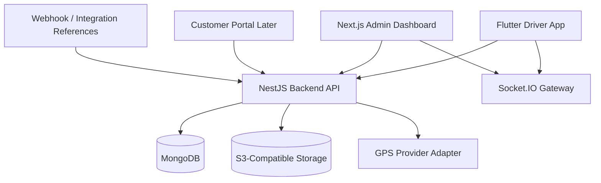

# Architecture Diagram

## Backend Modules

- Auth and RBAC
- Branches
- Customers
- Drivers
- Vehicles and Trailers
- Jobs and Shipments
- Dispatch
- Documents
- Agreements
- Tracking
- Incidents
- Notifications
- Dashboards
- Compliance
- Integrations
- Audit

